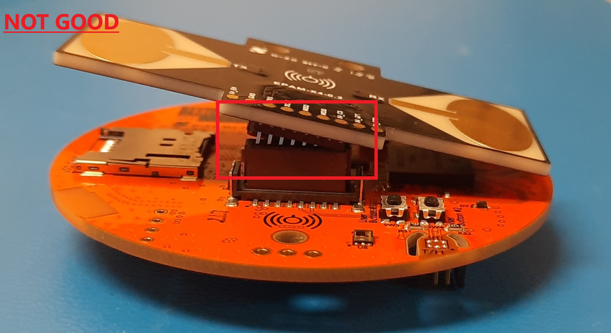
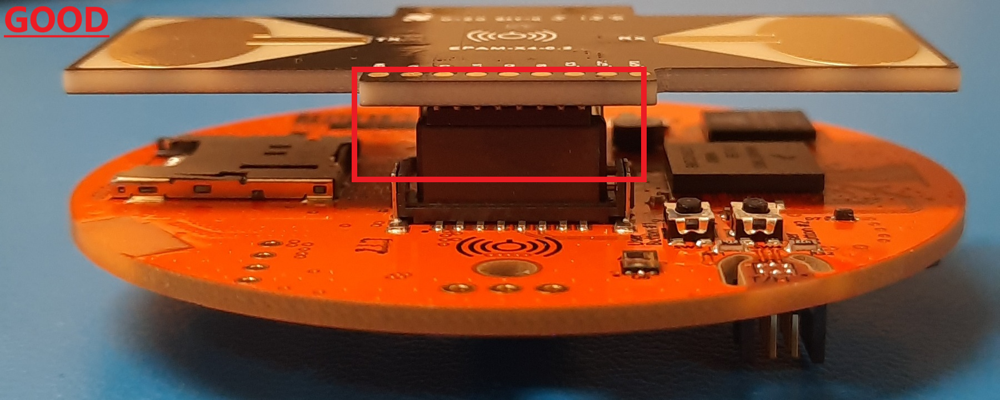
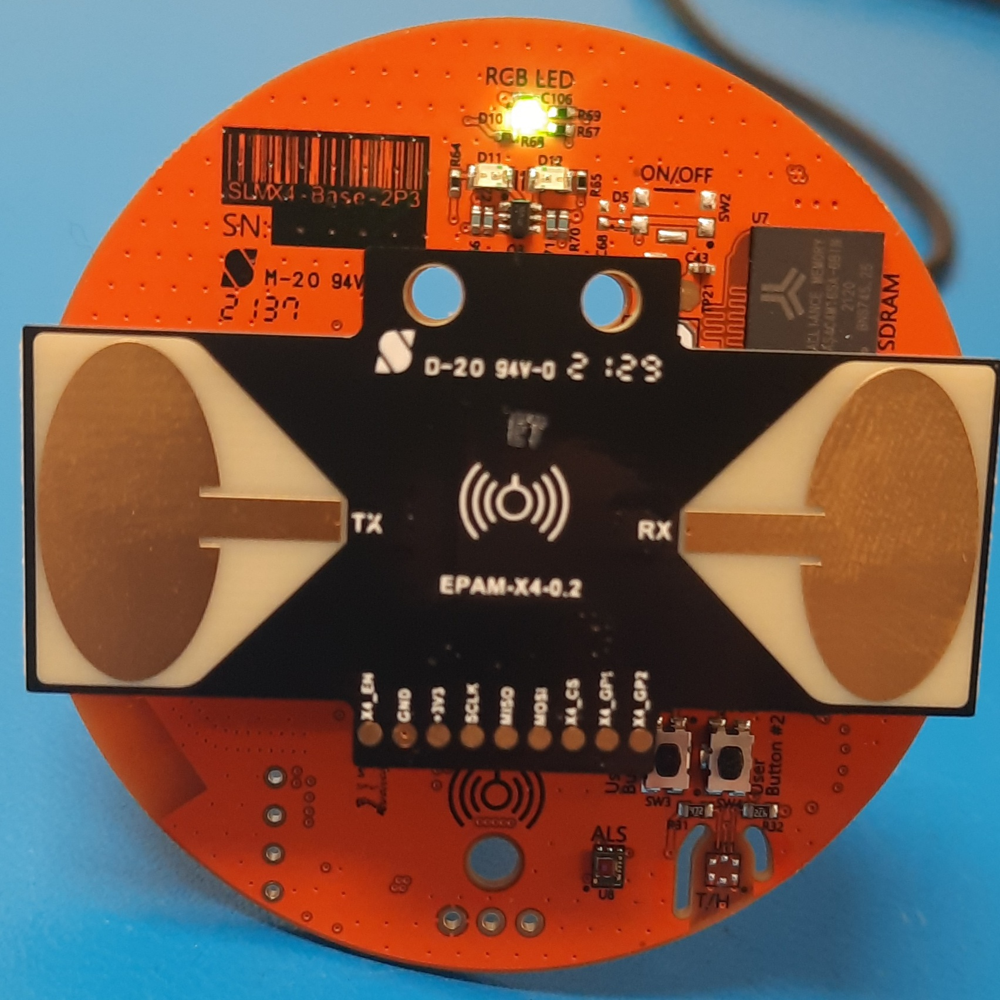

# Unboxing Quick Start Guide

[Back](../)

## Unbox and Verify Configuration

When you first receive your SLMX4 carefully remove it from the ESD packaging. Ensure the switch on the back, S2, is in the proper startup configuration:

**WARNING:** DO NOT CHANGE THIS CONFIGURATION WHILE THE MODULE IS POWERED 

Next, ensure that the EPAM is seated properly. Examples of improper placement could look like this:

Bad Seating Example #1      |  Bad Seating Example #2                       
:--------------------------:|:------------------------:
 | 

Instead, a proper EPAM connection will have this orientation with the pins fully seated and aligned with the connector, as shown here:
  
Proper Orientation Top    |  Proper Seating Side                      
:------------------------:|:--------------------:
 |   
  
## Power and Connect to a Windows Host Machine

Power up the SLMX4 via P1 (vertical micro-usb connector on the bottom side), with the provided cable, to a Windows host PC. Click on the start menu and search for _"Device Manager"_ and begin. Browse to _"Ports (COM & LPT)"_ and expand the menu. Ensure that the SLMX4 appears as _"Virtual Com Port (COM<##>)"_ where _"##"_ denotes the specific COM port number assigned to the SLMX4 from the host machine. Note the COM port number for later use.

If your module does not load in the device manager, click [HERE](../usb_driver) and follow the instructions to manually install the Windows driver. If your module does show up correctly, the RGB LED will be a green-yellow color, as shown:

## Change or Update Firmware

The SLMX4 will come pre-loaded with the MATLAB server firmware useful for radar development. If this is the desired firmware, start MATLAB, change the COM port to the correct number in the associated scripts, and start collecting radar signals! To switch to another firmware, e.g. the [Health Firmware](https://modules-release.s3-us-west-2.amazonaws.com/firmware/slmx4_base_usb_vcom_pb_dsp-epam0P1.s19), refer to the [SLMX4 Firmware Update Guide](../firmware/insecure_fw_update.md)..

These are the latest firmware binaries for both the Health and MATLAB development firmware:

- [SLMX4-Base Health Firmware](https://modules-release.s3-us-west-2.amazonaws.com/firmware/slmx4_base_usb_vcom_pb_dsp-epam0P1.s19)
- [SLMX4-Base MATLAB Firmware](https://modules-release.s3-us-west-2.amazonaws.com/firmware/slmx4_base_usb_vcom_xep_matlab_server.s19)

Here is the latest version of the Forms Health App: [SLMX4 Health App](https://modules-release.s3-us-west-2.amazonaws.com/health_windows_app/slmx4_health_ui_usb.zip)

Here is the user guide for using the Health App   : [SLMX4 Health App User Guide](../firmware/health_app.md)

## LED Definitions

The SLMX4 module comes equipped with an RGB LED, as well as a single Green and single Red LED. The color of the LEDs can help determine which firmware resides on the module, as well as the mode.

RGB Color    | Green Status       | RED Status           | Function
-------------|--------------------|----------------------|-----------------
Green-yellow | Green: Off         | Red: Off             | MATLAB firmware is loaded 
Teal         | Green: On (static) | Red: On (static)     | Ready to program new/different firmware
Off          | Green: Off         | Red: On (1 Hz blink) | Health firmware is loaded and not in operation
Green        | Green: Off         | Red: On (1 Hz blink) | Health firmware is loaded and in operation, presence is not detected
Violet       | Green: Off         | Red: On (1 Hz blink) | Health firmware is loaded and in operation, presence is detected
